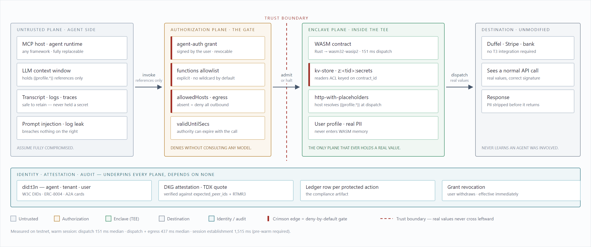
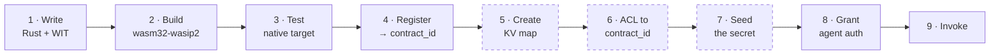
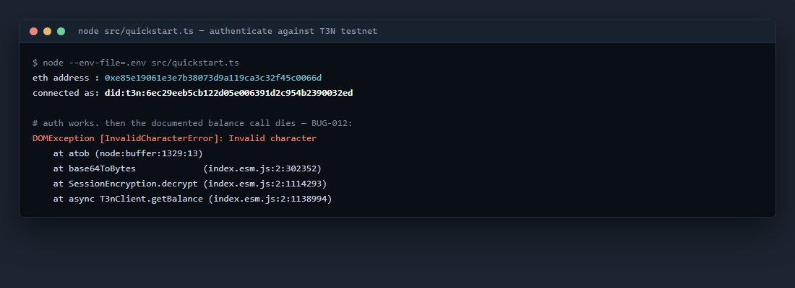
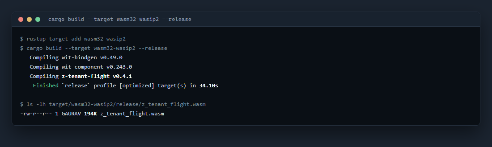
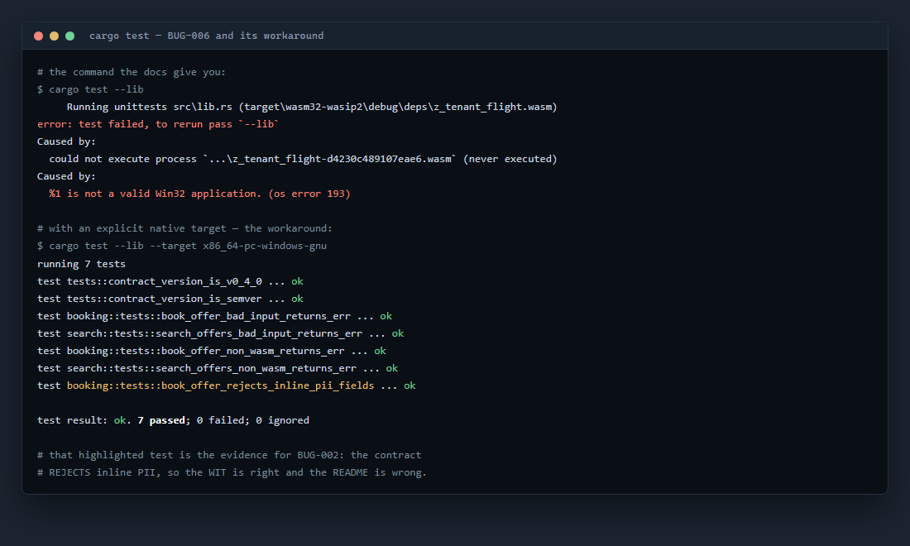
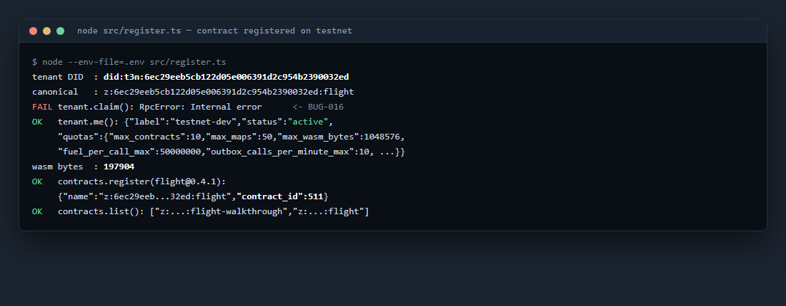
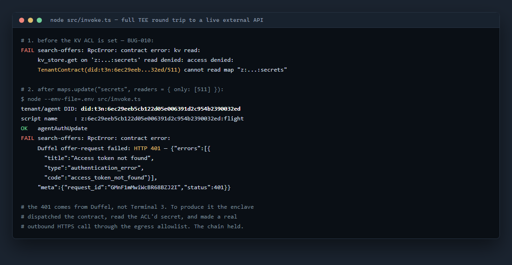
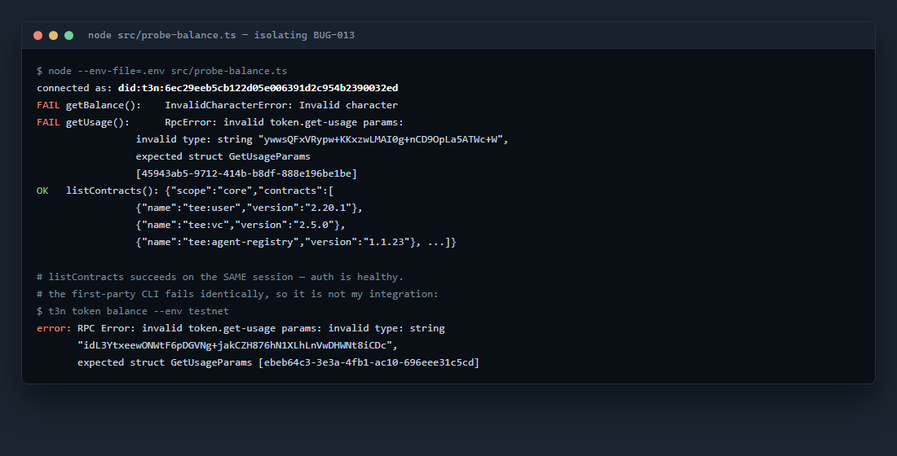
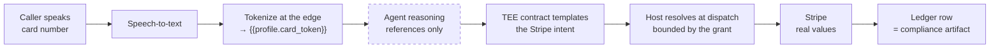

<div align="center">

# Building on Terminal 3

**A first integration: the ADK Quickstart and Walkthrough, completed end to end — with sixteen defects found on the way through**

Hitansh Gopani · 8 August 2026

[Full report (PDF)](docs/T3N-ADK-Submission-Hitansh-Gopani.pdf) ·
[Defect report — 16 entries](docs/BUGS.md) ·
[System design](docs/ARCHITECTURE.md) ·
[Raw transcripts](docs/RUN-LOG.md)

`did:t3n:6ec29eeb5cb122d05e006391d2c954b2390032ed` · `contract_id 511` · testnet

[gopanihitansh5@gmail.com](mailto:gopanihitansh5@gmail.com) · [@Hitansh54](https://x.com/Hitansh54)

</div>

---

I set out to answer one question: **can I put an AI agent in front of real customer data and a real payment rail without the data ever reaching the model?**

Terminal 3's answer is `http-with-placeholders`, and it works. I compiled a Rust contract to a WASM component, registered it on testnet, granted an agent scoped authority over it, and invoked it — watching the enclave read a secret I could not see and make a real outbound call with it. Then I measured how long that takes, because I build voice agents and a payment that misses the conversational turn budget is a payment that doesn't ship.

What follows is what worked, what broke, and what I'd need before putting it in production.

> [!WARNING]
> **The published Quickstart does not run.** `trustAnchor` is a required field the snippet omits, and because no testnet anchor values are published anywhere, the only way forward is to switch off the remote-attestation verification the platform exists to provide. Detail in [BUG-011](docs/BUGS.md).

---

## SECTION 01 · REFERENCE ARCHITECTURE

### Four planes, separated by trust boundary

The planes are separated by what each is *allowed to hold*. The property that matters commercially: **the agent plane can be fully compromised — prompt-injected, log-leaked, model-swapped — without a single real value crossing the boundary.**



<sub>**Fig. 1** — Four-plane reference architecture. Crimson edges are deny-by-default gates; they refuse without consulting any model, which makes the guarantee structural rather than a matter of policy. The dashed boundary is the line real values never cross leftward. Latency figures are measured, not specified — see § 04.</sub>

The consequence worth stating plainly: the LLM sits *beside* the secure path, never inside it. Nothing about the agent's behaviour — good or adversarial — changes what the enclave will release.

---

## SECTION 02 · WHAT COMPLETED

```diff
+ PASS  Claim API key + Agent DID
+ PASS  Quickstart — authenticate                 after supplying an undocumented field
- FAIL  Quickstart — read credit balance          broken on all 4 published surfaces
+ PASS  Walkthrough — write contract              Rust crate + WIT world
+ PASS  Walkthrough — build to wasm32-wasip2      194 KB component, 34 s
+ PASS  Walkthrough — test                        7/7, documented command fails
+ PASS  Walkthrough — register                    contract_id 511
+ PASS  Walkthrough — invoke                      full TEE round trip to a live API
```

| Field | Value |
|:--|:--|
| **Agent / Tenant DID** | `did:t3n:6ec29eeb5cb122d05e006391d2c954b2390032ed` |
| **Contract** | `z:6ec29eeb5cb122d05e006391d2c954b2390032ed:flight` @ `0.4.1` |
| **contract_id** | `511` |
| **Network** | testnet · `cn-api.sg.testnet.t3n.terminal3.io` |
| **Artifact** | `z_tenant_flight.wasm` — 197,904 bytes |
| **SDK / toolchain** | `@terminal3/t3n-sdk` 4.30.0 · Node 24.14.1 · Rust 1.97.1 |

### The lifecycle, and the three steps nobody documented



<sub>**Fig. 2** — The nine steps from source to a working invocation. Dashed nodes appear in no documentation ([BUG-010](docs/BUGS.md)); skipping them fails inside the enclave, where errors are deliberately not forwarded to the caller and are therefore hardest to diagnose.</sub>

---

## SECTION 03 · EVIDENCE

### 3.1 · Authenticate — Agent DID resolved on testnet



### 3.2 · Build the Rust contract to a WASM component



### 3.3 · Contract tests — and the documented command that fails



> [!TIP]
> The highlighted test — `book_offer_rejects_inline_pii_fields` — **passes**. That one line settles [BUG-002](docs/BUGS.md): the contract rejects inline PII, so the WIT is correct and the reference README is wrong about the platform's own flagship guarantee.

### 3.4 · Register the contract → `contract_id 511`



### 3.5 · Authorize the agent and invoke — full TEE round trip



> [!IMPORTANT]
> **The HTTP 401 is the success condition.** It comes from Duffel, not Terminal 3 — Duffel is refusing a placeholder token I supplied deliberately, having no Duffel account. To produce that refusal, the platform had to dispatch the contract into the enclave, instantiate the WASM component, resolve its host capabilities, read a secret from an access-controlled KV map, and perform real outbound HTTPS through the egress allowlist. **Every link in the chain held.** The only fake thing in the transaction was my third-party credential.

### 3.6 · Isolating the credit-balance failure



`listContracts()` succeeding on the *same session* proves handshake and auth are healthy, confining the fault to the sealed-payload RPCs. The first-party CLI fails identically — which is what turns this from "my integration is wrong" into "this is shipped and broken."

---

## SECTION 04 · THE LATENCY BUDGET

Every component belongs to a timescale, and the timescale decides what it is allowed to do. A conversational turn degrades past **500–800 ms** and stops feeling like a conversation past **~1.5 s**. So I measured rather than assumed ([`src/bench-latency.ts`](src/bench-latency.ts), 5 rounds, warm session):

| Timescale | Component | Verdict |
|:--|:--|:--|
| **~150 ms** | TEE dispatch + WASM instantiation, no network | Cheap enough to sit anywhere on the path |
| **~440 ms** | Dispatch + real outbound HTTPS to an external API | Fits one conversational turn — headroom is thin |
| **~1,500 ms** | Session establishment (handshake + authenticate) | **Must be off the critical path** — pre-warm before the call connects |

> [!IMPORTANT]
> **The enclave is not the bottleneck — the network is.** Dispatch plus WASM instantiation costs 151 ms; the remaining 286 ms is egress. That is a genuinely good result for Terminal 3: confidential computing is not what costs you the conversation. But session establishment at ~1.5 s is decisive — an agent must hold an authenticated session open while the phone is still ringing, because it cannot afford to build one mid-call.

---

## SECTION 05 · DEFECTS

Sixteen filed. Full repro, expected-versus-actual, and workaround for each in **[docs/BUGS.md](docs/BUGS.md)**.

| | # | Defect |
|:--|:--|:--|
| 🔴 | **002** | Reference contract's README and WIT document **opposite** PII security models |
| 🔴 | **011** | Quickstart code doesn't run; the only available fix disables attestation |
| 🟠 | **013** | Credit balance broken on all 4 surfaces — SDK *and* first-party CLI |
| 🟠 | **012** | `getBalance()` throws inside the SDK's own decrypt path |
| 🟠 | **010** | Invocation needs an undocumented KV map with a `contract_id`-keyed ACL |
| 🟠 | **005** | Sample's capability manifest omits a capability its own WIT imports |
| 🟠 | **003** | Registering a new version silently re-routes *pinned* older versions |
| 🟠 | **014** | SDK ships a **critical** Zip Slip advisory in its dependency tree |
| 🟡 | **006** | `.cargo/config.toml` target pin breaks the documented `cargo test` |
| 🟡 | **016** | `tenant.claim()` returns a bare `Internal error` |
| 🟡 | **015** | Shipped SDK is obfuscated, no source maps — 1.2 MB stack traces |
| 🟡 | **009** | API key unrecoverable, no documented rotation path |
| ⚪ | **004** | Docs state the wrong default environment for *both* SDK and CLI |
| ⚪ | **007** | Sample repo carries three different version numbers |
| ⚪ | **001** | `sandbox` / `testnet` / `production` naming inconsistent across surfaces |
| ⚪ | **008** | "No Rust or WASM knowledge required" contradicted by the next page |

<sub>🔴 Critical · 🟠 High · 🟡 Medium · ⚪ Low</sub>

### The two that would change my adoption decision

<table>
<tr><td width="50%" valign="top">

**🔴 BUG-011 — the front door is locked, and the spare key disables the alarm**

`T3nClientConfig.trustAnchor` is required. The published snippet omits it, so `handshake()` throws on line one of the tutorial.

A valid anchor needs `expected_peer_ids` and `rtmr3_allowlist` — values published **nowhere**: not the docs, not the SDK reference, not the package exports. The only way forward is `unsafe_trust_server: true`, which the SDK's own source calls "the *only* way to skip DKG attestation verification."

So every developer's first act on the platform is switching off the guarantee they came for — and nothing tells them they did it.

</td><td width="50%" valign="top">

**🔴 BUG-002 — the reference contract contradicts itself about PII**

README: `book-offer` posts *"with full passenger PII … passed in by the agent."*

`world.wit`: it *"Carries **NO** passenger PII,"* resolving `{{profile.*}}` host-side.

These are opposite security models, in one repository, describing one function. The crate's own test suite settles it — `book_offer_rejects_inline_pii_fields` passes — so the WIT is right.

Which means the README teaches newcomers the exact pattern the product exists to prevent.

</td></tr>
</table>

> [!NOTE]
> **Two defects were corrected downward after verification.** BUG-001 and BUG-004 were both filed at higher severity from documentation review, then disproved by running the code — the environments turned out to be aliases sharing one URL, and the CLI default turned out to be the safe one, with the *docs* being wrong. Both are kept in the report with their original reasoning visible rather than quietly edited. A severity rating is only worth reading if the ones that moved are shown moving.

---

## SECTION 06 · BEYOND THE FIRST CONTRACT

### Voice-agent payment authorization

Full design, contract sketch, grant shape, barge-in state machine and open questions in **[ARCHITECTURE.md § 6](docs/ARCHITECTURE.md)**.

I build voice agents. When a caller reads a card number aloud, that number lands in the speech-to-text transcript, the model's context window, and every log and trace downstream. Redacting afterwards doesn't help — it was already in the prompt. This is the single biggest reason voice agents don't take payments.

`http-with-placeholders` inverts the problem. The agent never receives the card at all:



<sub>**Fig. 3** — Payment authorization without the card entering the model. The dashed node is the point: because the agent only ever held a reference, the transcript and context window become safe to log — which is what makes the call recordable and the flow auditable.</sub>

The grant carries `validUntilSecs`, so payment authority can expire when the call ends rather than persisting as a standing credential. That is the property I most want to test next.

**The part I can't yet solve:** barge-in during an in-flight authorization. If the caller says *"cancel that"* 200 ms into a 437 ms payment, the payment completes regardless. The honest design isn't to cancel mid-flight — it's to keep the window small, treat every authorization as reversible for a bounded period, and have the agent speak the outcome either way.

---

## SECTION 07 · REPOSITORY

```
src/
  client.ts          shared auth bootstrap (handshake + authenticate)
  quickstart.ts      Quickstart — DID + credit balance
  register.ts        register the WASM component → contract_id
  seed-secrets.ts    create + ACL the secrets KV map   ← undocumented (BUG-010)
  invoke.ts          agent-auth grant, then invoke
  probe-balance.ts   diagnostic isolating BUG-012 / BUG-013
  bench-latency.ts   latency measurement behind § 04
contract/            z-tenant-flight (MIT, Terminal-3) built to wasm32-wasip2
docs/
  BUGS.md            defect report — 16 entries with repros
  ARCHITECTURE.md    system design, trust model, sequence diagrams
  RUN-LOG.md         verbatim terminal transcripts
  SUBMISSION.md      narrative report (markdown source of the PDF)
  figures/           Fig. 1 source (hand-authored SVG) + rendered PNG
screenshots/
  terminal/          run captures, typeset from RUN-LOG.md
  *.jpg              live captures of the defects on Terminal 3's own pages
```

### Reproduce it

```bash
npm install @terminal3/t3n-sdk
printf 'T3N_API_KEY=0x<your key from the claim page>\n' > .env

node --env-file=.env src/quickstart.ts                       # authenticate, print DID
cd contract && cargo build --target wasm32-wasip2 --release  # build the component
cargo test --lib --target x86_64-pc-windows-gnu && cd ..     # tests — note the explicit target
node --env-file=.env src/register.ts                         # register → contract_id
node --env-file=.env src/seed-secrets.ts                     # KV map + ACL (edit CONTRACT_ID)
node --env-file=.env src/invoke.ts                           # grant + invoke
node --env-file=.env src/bench-latency.ts                    # reproduce the § 04 numbers
```

> [!TIP]
> **`tsx` is not required** — Node 24 strips TypeScript types natively. Worth knowing, because `tsx` cannot install at all in a OneDrive-synced directory: its `esbuild` postinstall fails to spawn its own binary.

---

## SECTION 08 · WHAT I'D FIX FIRST

Ordered by how much developer time each one returns.

1. **Publish testnet trust-anchor values.** One paragraph removes the worst defect here and stops every new developer from disabling attestation as their opening move.
2. **Fix `token.get-usage`.** The sandbox's headline offer is 20,000 credits that currently cannot be observed through any published surface — SDK or CLI.
3. **Add the KV map and ACL step to the invoke page.** Three commands, currently zero words, and skipping them fails inside the enclave where diagnosis is hardest.
4. **Ship source maps.** Isolating these defects meant reading type declarations, because the implementation is obfuscated and every stack frame resolves to `index.esm.js:2`.

None of these are architectural. The hard part — confidential execution with host-resolved secrets and an auditable grant model — already works, and the measured numbers say it works fast enough for a phone call. The gap is entirely in the path a new developer walks on day one.

---

<div align="center">

**Hitansh Gopani** · [gopanihitansh5@gmail.com](mailto:gopanihitansh5@gmail.com) · [@Hitansh54](https://x.com/Hitansh54)

<sub><code>contract/</code> is <a href="https://github.com/Terminal-3/z-tenant-flight">Terminal-3/z-tenant-flight</a> (MIT), vendored unmodified. Everything in <code>src/</code> and <code>docs/</code> is mine.<br/>
Terminal images are typeset from the verbatim transcripts in <a href="docs/RUN-LOG.md">RUN-LOG.md</a>; documentation screenshots are live captures of Terminal 3's own published pages.</sub>

</div>
