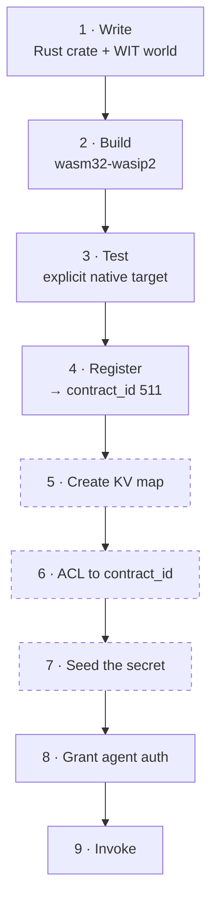
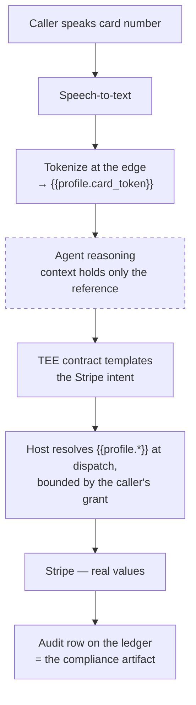

<div align="center">

# Terminal 3 ADK — Quickstart &amp; Walkthrough, Completed

**Bounty submission** · Hitansh Gopani · 8 August 2026

[Formatted submission (PDF)](docs/T3N-ADK-Submission-Hitansh-Gopani.pdf) ·
[Bug report — 16 bugs](docs/BUGS.md) ·
[System design](docs/ARCHITECTURE.md) ·
[Raw transcripts](docs/RUN-LOG.md)

`did:t3n:6ec29eeb5cb122d05e006391d2c954b2390032ed` · `contract_id 511` · testnet

[gopanihitansh5@gmail.com](mailto:gopanihitansh5@gmail.com) · [@Hitansh54](https://x.com/Hitansh54)

</div>

---

> [!NOTE]
> **Both sections completed under my Agent ID.** A Rust TEE contract compiled to a WASM
> component, registered on T3N testnet, authorized to an agent identity, and invoked end to
> end — with the enclave making a real outbound HTTPS call to a live external API.

> [!WARNING]
> **The published Quickstart code does not run.** `trustAnchor` is a required field that the
> snippet omits, and because no testnet anchor values are published anywhere, the only way
> through is to disable the remote-attestation verification the product exists to provide.
> Full detail in [BUG-011](docs/BUGS.md).

---

## Completion status

```diff
+ PASS  Claim API key + Agent DID
+ PASS  Quickstart — authenticate                 (after supplying an undocumented field)
- FAIL  Quickstart — read credit balance          broken on all 4 published surfaces
+ PASS  Walkthrough — write contract              Rust crate + WIT world
+ PASS  Walkthrough — build to wasm32-wasip2      194 KB component, 34 s
+ PASS  Walkthrough — test                        7/7 (documented command fails)
+ PASS  Walkthrough — register                    contract_id 511
+ PASS  Walkthrough — invoke                      full TEE round trip to a live API
```

| Field | Value |
|:--|:--|
| **Agent / Tenant DID** | `did:t3n:6ec29eeb5cb122d05e006391d2c954b2390032ed` |
| **Contract** | `z:6ec29eeb5cb122d05e006391d2c954b2390032ed:flight` @ `0.4.1` |
| **contract_id** | `511` |
| **Network** | testnet · `cn-api.sg.testnet.t3n.terminal3.io` |
| **Artifact** | `z_tenant_flight.wasm` — 197,904 bytes |
| **SDK / toolchain** | `@terminal3/t3n-sdk` 4.30.0 · Node 24.14.1 · Rust 1.97.1 |

---

## Evidence

### 1 · Authenticate — Agent DID resolved on testnet


### 2 · Build the Rust contract to a WASM component


### 3 · Contract tests — and the documented command that fails


> [!TIP]
> The highlighted test — `book_offer_rejects_inline_pii_fields` — **passes**. That single
> line is what proves [BUG-002](docs/BUGS.md): the contract rejects inline PII, so the WIT
> is correct and the reference README is wrong.

### 4 · Register the contract → `contract_id 511`


### 5 · Authorize the agent and invoke — full TEE round trip


> [!IMPORTANT]
> **The HTTP 401 is the success condition.** It comes from Duffel, not Terminal 3 — Duffel
> is rejecting a placeholder token I supplied deliberately, having no Duffel account. To
> produce that rejection, T3 had to dispatch the contract into the enclave, instantiate the
> WASM component, resolve its host capabilities, read a secret from an access-controlled KV
> map, and perform real outbound HTTPS through the egress allowlist. **Every link in the
> chain held.**

### 6 · Isolating the credit-balance failure


`listContracts()` succeeding on the *same session* proves handshake and auth are healthy,
which confines the fault to the sealed-payload RPCs. The first-party CLI fails identically —
so this is a shipped defect, not an integration mistake.

---

## The system, as I understand it after building on it

Full write-up with sequence and trust-model diagrams in
**[docs/ARCHITECTURE.md](docs/ARCHITECTURE.md)**.



The three dashed steps appear in **no documentation** — that's
[BUG-010](docs/BUGS.md), and skipping them fails inside the enclave where it is hardest to
diagnose.

---

## Bugs — 16 filed

Full repros, expected-vs-actual, and workarounds in **[docs/BUGS.md](docs/BUGS.md)**.

| | # | Bug |
|:--|:--|:--|
| 🔴 | **002** | Reference contract's README and WIT document **opposite** PII security models |
| 🔴 | **011** | Quickstart code doesn't run; the only fix disables attestation verification |
| 🟠 | **013** | Credit balance broken on all 4 surfaces — SDK *and* first-party CLI |
| 🟠 | **012** | `getBalance()` throws inside the SDK's own decrypt path |
| 🟠 | **010** | Invocation needs an undocumented KV map with a `contract_id`-keyed ACL |
| 🟠 | **005** | Sample's capability manifest omits a capability its own WIT imports |
| 🟠 | **003** | Registering a new version silently re-routes *pinned* older versions |
| 🟠 | **014** | SDK ships a **critical** Zip Slip advisory in its dependency tree |
| 🟡 | **006** | `.cargo/config.toml` target pin breaks the documented `cargo test` |
| 🟡 | **016** | `tenant.claim()` returns a bare `Internal error` |
| 🟡 | **015** | Shipped SDK is obfuscated, no source maps — 1.2 MB stack traces |
| 🟡 | **009** | API key unrecoverable, no documented rotation path |
| ⚪ | **004** | Docs state the wrong default environment for *both* SDK and CLI |
| ⚪ | **007** | Sample repo carries three different version numbers |
| ⚪ | **001** | `sandbox` / `testnet` / `production` naming inconsistent across surfaces |
| ⚪ | **008** | "No Rust or WASM knowledge required" contradicted by the next page |

<sub>🔴 Critical · 🟠 High · 🟡 Medium · ⚪ Low</sub>

### The two worth fixing first

<table>
<tr><td width="50%" valign="top">

**🔴 BUG-011 — the Quickstart doesn't run, and the obvious fix turns off the security**

`T3nClientConfig.trustAnchor` is required. The published snippet omits it, so `handshake()`
throws. A valid anchor needs `expected_peer_ids` and `rtmr3_allowlist` — values published
**nowhere**. The only way forward is `unsafe_trust_server: true`, which the SDK's own source
calls "the *only* way to skip DKG attestation verification."

Every developer completing your Quickstart disables remote attestation as their first
action, and is never told.

</td><td width="50%" valign="top">

**🔴 BUG-002 — the reference contract contradicts itself on PII**

README: `book-offer` posts *"with full passenger PII … passed in by the agent."*

`world.wit`: it *"Carries **NO** passenger PII,"* resolving `{{profile.*}}` host-side.

The crate's own test `book_offer_rejects_inline_pii_fields` passes — so the WIT is right and
the README documents the exact pattern the product exists to prevent.

</td></tr>
</table>

> [!NOTE]
> **Two bugs were corrected downward after verification.** BUG-001 and BUG-004 were both
> filed at higher severity from documentation review, then disproved by running the code —
> the environments turned out to be aliases, and the CLI default turned out to be the safe
> one. Both are kept with their original reasoning visible rather than quietly edited.
> Severities are only useful if they can be trusted.

---

## Repository layout

```
src/
  client.ts          shared auth bootstrap (handshake + authenticate)
  quickstart.ts      Quickstart — DID + credit balance
  register.ts        register the WASM component → contract_id
  seed-secrets.ts    create + ACL the secrets KV map   ← undocumented (BUG-010)
  invoke.ts          agent-auth grant, then invoke
  probe-balance.ts   diagnostic isolating BUG-012 / BUG-013
contract/            z-tenant-flight (MIT, Terminal-3) built to wasm32-wasip2
docs/
  BUGS.md            the bug report — 16 entries with repros
  ARCHITECTURE.md    system design, trust model, sequence diagrams
  RUN-LOG.md         verbatim terminal transcripts
  SUBMISSION.md      submission narrative (markdown source of the PDF)
screenshots/
  terminal/          run captures, typeset from RUN-LOG.md
  *.jpg              live captures of the defects on Terminal 3's own pages
```

## Reproduce it

```bash
npm install @terminal3/t3n-sdk
printf 'T3N_API_KEY=0x<your key from the claim page>\n' > .env

node --env-file=.env src/quickstart.ts                       # authenticate, print DID
cd contract && cargo build --target wasm32-wasip2 --release  # build the component
cargo test --lib --target x86_64-pc-windows-gnu && cd ..     # tests — note the explicit target
node --env-file=.env src/register.ts                         # register → contract_id
node --env-file=.env src/seed-secrets.ts                     # KV map + ACL (edit CONTRACT_ID)
node --env-file=.env src/invoke.ts                           # grant + invoke
```

> [!TIP]
> **`tsx` is not required** — Node 24 strips TypeScript types natively. Worth knowing,
> because `tsx` cannot install at all in a OneDrive-synced directory: its `esbuild`
> postinstall fails to spawn its binary.

---

## Bonus — beyond the first contract

**Voice-agent payment authorization.** Full design, contract sketch, grant shape, and open
questions in [docs/ARCHITECTURE.md § 6](docs/ARCHITECTURE.md).

I build voice agents. When a caller reads a card number aloud, that number lands in the
speech-to-text transcript, the model's context window, and every log and trace downstream.
Redacting afterwards doesn't help — it was already in the prompt. It is the single biggest
reason voice agents don't take payments.

`http-with-placeholders` inverts it — the agent never receives the card:



The dashed node is the point: **the transcript and model context become safe to log**,
because they never held anything sensitive. The grant carries `validUntilSecs`, so the
payment authority can expire when the call ends rather than persisting as a standing
credential — that's the part I most want to test next.

---

## What would have made this faster

1. **Publish testnet trust-anchor values.** One paragraph removes the worst bug here, and stops every new developer from disabling attestation as their first act.
2. **Fix `token.get-usage`.** The sandbox's headline offer is 20,000 credits that currently cannot be observed through any published surface.
3. **Add the KV map + ACL step to the invoke page.** Three commands, currently zero words.
4. **Ship source maps.** Isolating these bugs meant reading type declarations, because the implementation is obfuscated.

---

<div align="center">

**Hitansh Gopani** · [gopanihitansh5@gmail.com](mailto:gopanihitansh5@gmail.com) · [@Hitansh54](https://x.com/Hitansh54)

<sub><code>contract/</code> is <a href="https://github.com/Terminal-3/z-tenant-flight">Terminal-3/z-tenant-flight</a> (MIT), vendored unmodified. Everything in <code>src/</code> is mine.<br/>
Terminal screenshots are typeset from the verbatim transcripts in <a href="docs/RUN-LOG.md">RUN-LOG.md</a>; documentation screenshots are live captures of Terminal 3's own pages.</sub>

</div>
