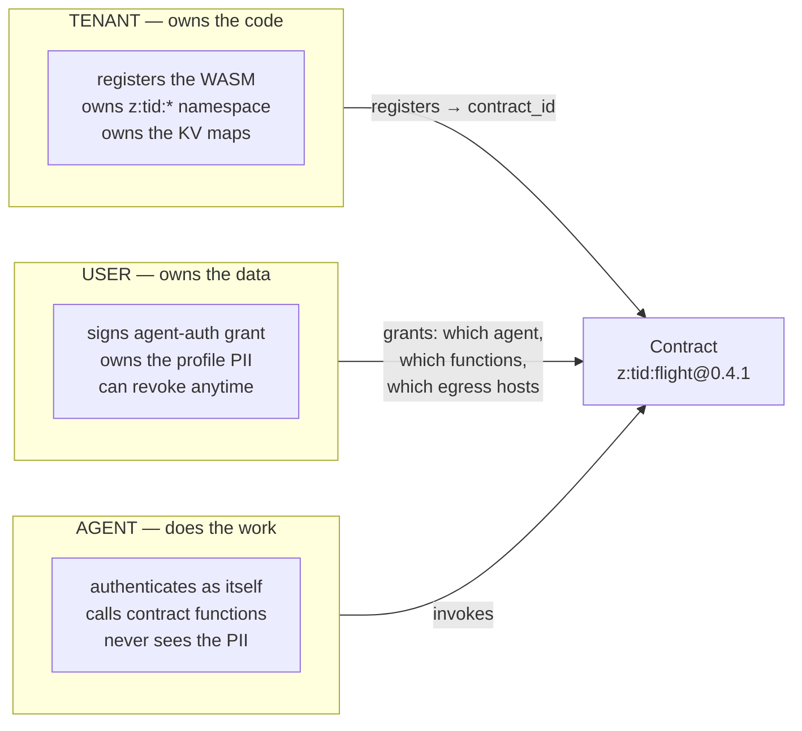
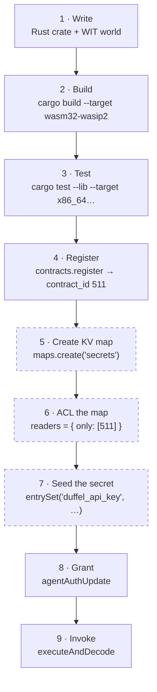
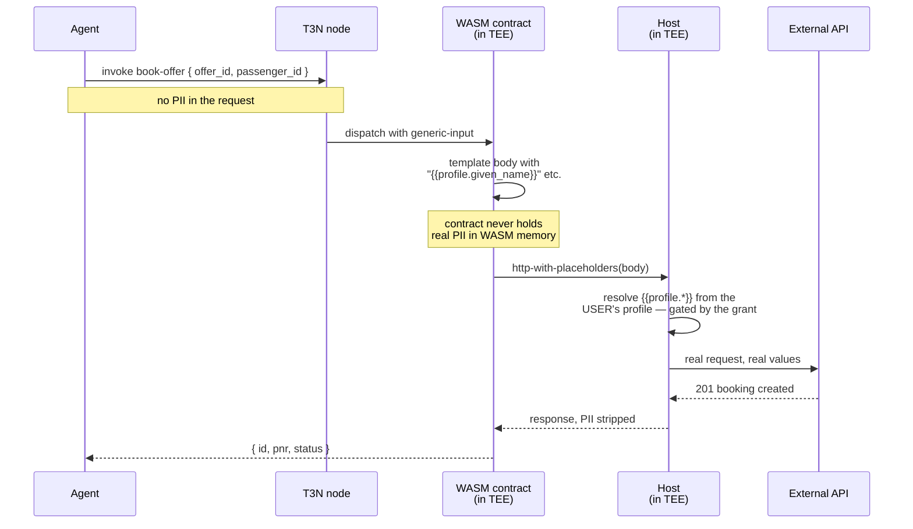
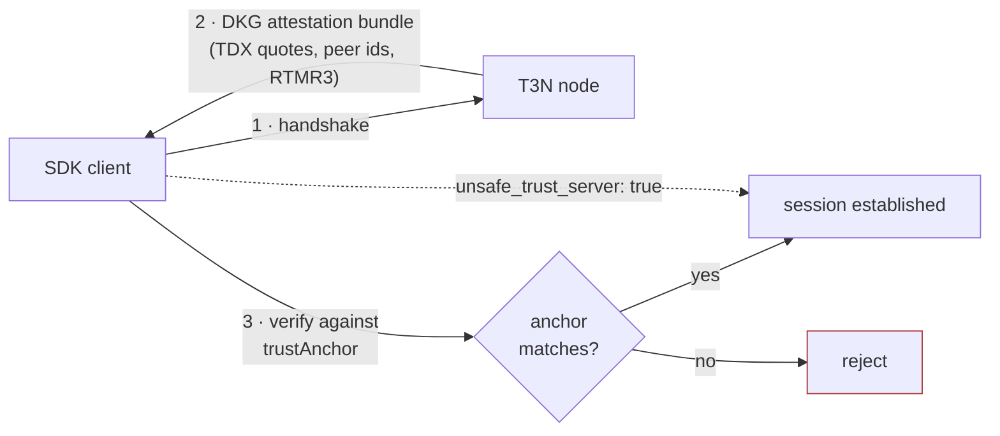
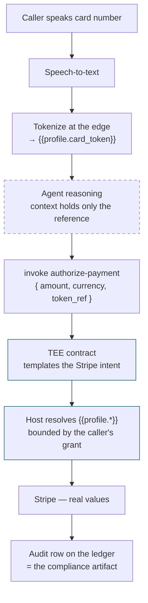

# System design — what T3N actually is, and how the pieces fit

Written while completing the Walkthrough. The docs explain each step in isolation but never
draw the whole system, and several of the bugs in [BUGS.md](BUGS.md) are only obvious once
you can see it end to end.

---

## 1. A "contract" here is not a smart contract

This is the first thing that trips people up, and the Quickstart never states it plainly.

| | EVM smart contract | T3N TEE contract |
|---|---|---|
| Language | Solidity | **Rust** |
| Compiles to | EVM bytecode | **WASM component** (`wasm32-wasip2`) |
| Interface | ABI | **WIT world** |
| Executes on | Every validator, publicly | **Inside one enclave**, privately |
| Can call the internet | No (needs an oracle) | **Yes** — host-mediated, allowlisted |
| State | On-chain storage | Host KV maps, ACL'd per contract |
| Costs | Gas | Metered credits + a fuel budget |

The value proposition follows from row five: a T3N contract can hold a secret, call a real
API with it, and prove what it did — none of which an EVM contract can do.

---

## 2. Three identities, and why invocation needs all of them

The single biggest conceptual hurdle. A working invocation involves three distinct DIDs
that people assume are one.



In this submission all three are the same DID — self-invocation, which the docs endorse as
the fast path. In production they separate: the tenant is your company, the user is your
customer, the agent is the thing you deployed.

**The authorization grant is the interesting part.** It is not a role, it is a
capability tuple, signed by the person whose data is at risk:

```typescript
{
  agentDid:     "did:t3n:…",        // who
  scriptName:   "z:<tid>:flight",   // may call what
  functions:    ["search-offers"],  // which entry points
  allowedHosts: ["api.duffel.com"], // and may talk to whom
}
```

An absent `allowedHosts` is read as **deny-all egress**, not allow-all. That default is the
right way round.

---

## 3. The lifecycle, and the step that isn't documented



**Steps 5–7 appear in no documentation** — they are [BUG-010](BUGS.md). Skipping them
produces a failure inside the enclave, which is the hardest place to debug:

```
access denied: TenantContract(did:t3n:<tid>/511) cannot read map "z:<tid>:secrets"
```

Note what the ACL is keyed on: the **numeric `contract_id`**, not the contract name. That
is the real reason `register-contract` tells you to keep every id — and that page never
explains why.

---

## 4. The mechanism that makes T3N worth using

`http-with-placeholders` is the whole product in one diagram. The contract composes a
request it cannot itself read the secrets of; the **host** substitutes them at dispatch,
inside the enclave.



Three properties fall out of this, and they are what a compliance reviewer cares about:

1. **PII never enters WASM memory** — so a contract bug cannot leak it.
2. **PII never enters the agent's context** — so a prompt-injection or a log dump cannot leak it.
3. **Resolution is gated by the user's grant** — so consent is enforced at dispatch, not by convention.

[BUG-002](BUGS.md) matters precisely because the reference README describes the *opposite*
of this diagram.

---

## 5. Trust model, and where the Quickstart breaks it



The dotted line is the problem. A `TrustAnchor` needs `expected_peer_ids` and
`rtmr3_allowlist` — the independent ground truth that stops an attacker with their own TDX
VM forging a valid-looking bundle for a key they control.

**Those values are published nowhere**, and the Quickstart omits the field entirely, so the
only way to complete the tutorial is the dotted path. Every developer's first act is
switching off the verification. That is [BUG-011](BUGS.md), and it is the single highest
-leverage fix on this list: publishing testnet anchor values closes it in one paragraph.

---

## 6. Proposed: voice-agent payment authorization

The use case for the bonus. Not built yet — this is the design I intend to implement with
the remaining credits.

**The problem.** When a caller reads a card number to a voice agent, it lands in the STT
transcript, the model's context window, and every log and trace downstream. Redacting after
the fact does not help: it was already in the prompt. This is the reason voice agents do
not take payments.



The dashed node is the one that matters: **the transcript and the model context are now
safe to log**, because they never contained anything sensitive.

**Contract sketch**

```wit
interface contracts {
  /// Input:  { amount_cents, currency, token_ref, idempotency_key }
  /// Carries NO card data. Templates {{profile.card_token}} and
  /// {{profile.dob}} into the Stripe intent; host resolves at dispatch.
  /// Output: { intent_id, status, last4 }
  authorize-payment: func(req: generic-input) -> result<list<u8>, string>;
}
```

**Grant shape** — the caller bounds both amount and destination:

```typescript
{
  agentDid:     "did:t3n:<voice-agent>",
  scriptName:   "z:<tid>:voicepay",
  functions:    ["authorize-payment"],
  allowedHosts: ["api.stripe.com"],
  validUntilSecs: <call end + 300>,   // grant dies with the call
}
```

That `validUntilSecs` is the part I am most interested in testing: a payment authority that
expires when the phone call does, rather than persisting as a standing credential.

**Open questions I would want T3's input on**

1. Is edge tokenization before the LLM the intended pattern, or does T3 expect the raw value to reach the profile store by another route?
2. Can `{{profile.*}}` resolve from a per-session profile rather than a durable user profile? A first-time caller has no stored profile.
3. Does the ledger audit row capture enough for PCI evidence, or is it a pointer to something richer?
